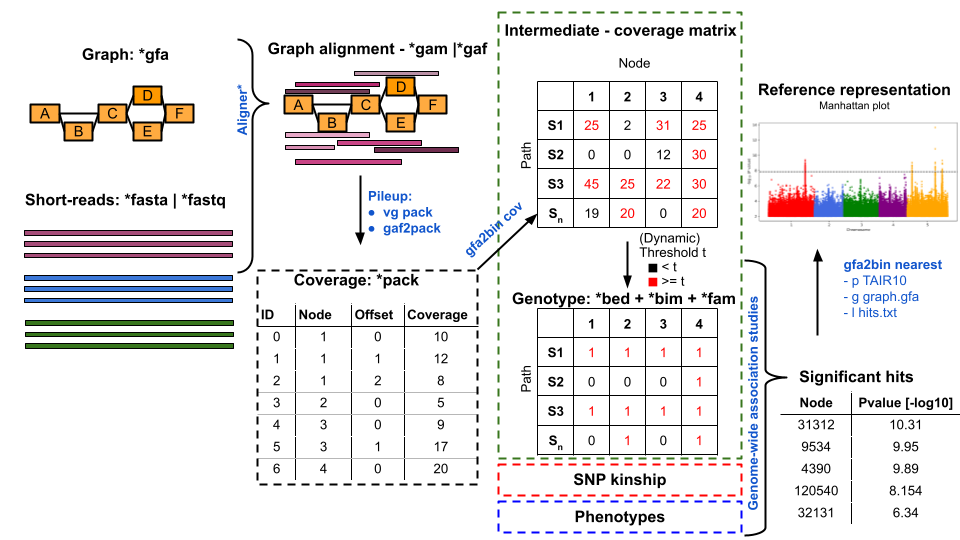

# gfa2bin

Convert various graph-related data to [PLINK](https://www.cog-genomics.org/plink/1.9/formats) file. In addition, we offer multiple commands for filtering or modifying the generated PLINK files.

**Example using sequence-to-graph alignments** 



---
## Installation
```
git clone https://github.com/MoinSebi/gfa2bin
cd gfa2bin
cargo build --release
./target/release/gfa2bin -h 
```

---
## Testing 

We provide a small test suite to test the basic functionality of the tool.
```
cargo test
```
---
## Alternative output (BIMBAM)
Alternatively to PLINK files, most commands can also output [BIMBAM](https://www.haplotype.org/download/bimbam-manual.pdf) (Mean Genotype File) format. This format was published to cover imputed genotypes, scaling them from 0.0 to 2.0 range.

Description of the [format](https://www.haplotype.org/download/bimbam-manual.pdf):
```
The first column of the mean genotype files is the SNP ID, the second and
third columns are allele types with minor allele first. The rest columns are the mean genotypes of
different individuals – numbers between 0 and 2 that represents the (posterior) mean genotype, or
6
dosage of the minor allele. An example of mean genotypes file of two SNPs and three individuals
follows.
rs1, A, T, 0.02, 0.80, 1.50
rs2, G, C, 0.98, 0.04, 1.00'
```
---
# Usage

## Graph to PLINK
### 1. *graph* - Converting from graphs directly
Convert a graph in gfa format to a plink or bimbam format. You are able to specify which feature (```-f ```) you want to use as entry. We support nodes (1), edges (1+2+), and directed nodes (1+). Path can be merged to samples using the [PanSN-spec](https://github.com/pangenome/PanSN-spec), which is highly recommended.  
We count occurrence of each feature in each path/sample in the graph and use them as genotypes. A detailed description of the output can be found here. 

##### Diploid
We are able to provide information about ploidy based on the PanSN-spec (**PanSN must be used**). In PLINK files, ploidy can easily be represented by 11, 01, 10, 00. In a BIM file, we use the average of both "scaled" haplotypes.


#### Example usage: 
````text
gfa2bin graph -g input.gfa -o output -f node --bimbam 
gfa2bin graph -g input.gfa -o output -f dirnode -m mean -r 0.5 --pansn '#'
````

---
### 2. *Subpath* - Include neighboring information
Other than the "graph" subcommand, this subcommand is able to include neighboring information for a node and convert it. In general, we iterate over each node in the graph, extract the subpaths (+/- X steps away from the origin) traversing this node, and collect all subpaths. Subpath-groups (same subpath found in different paths) are then used as genotypes. 

#### Example usage: 
````text
gfa2bin subpath -g input.gfa -o subpath.plink  -s 3 -t 4
````

---

---
## Coverage to PLINK
     
### *cov* - Using graph coverage

Convert coverage information from sequence-to-graph alignments to genotypes. Either can use plain-text pack files (also *zstd* compressed) directly or use one of the custom coverage file formats from [packing repository](https://github.com/MoinSebi/packing) as input. The ``packing`` repository helps to reduce storage and can perform pre-processing on sample level.  
Comparable to ``graph`` subcommand, we offer additional normalization on sample-level. 

**Inputs:**   
- ``-p, --packlist`` - List of pack files (tab-sep sample_name and path/to/file)
- ``-l, --pc-list``* - List of **custom** pack files (tab-sep sample_name and path/to/file)
- ``-c, --pc``* - Custom pack file (single file, normally concatenated from multiple pack files)

**Comment:**
Those marked with "*" need an additional index, that can be created using the packing method.

#### Example usage: 
````text 
./target/release/gfa2bin cov --packlist pack.list.txt -o output.plink
````

---


---
## Modify your PLINK

---
### Remove
Remove samples or genotypes from the PLINK files (bed, bim, fam). 

#### Example usage: 
````text
./target/release/gfa2bin remove -p plink.input --samples samples.txt --genotypes genotypes_names.txt -o output_plink
````

---
### Filter
Filter entries or samples from a PLINK file. 

**Samples can be filtered by:**

- ``--missing-rate`` Percentage of missing genotypes
- ``missing-count`` Number of missing genotypes

**Genotypes can be filtered by:**
- ``--MAF`` Major allele frequency
- ``--maf`` Minor allele frequency
- ``--MAC`` major allele count
- ``--mac`` Minor allele count)

---
### Split and merge
#### Split 
Split a single PLINK file (bed, bim, fam) into multiple parts of the same size. This might be preferred if the testing data set is very big and performing GWAS takes a lot of time and downstream multithreading not is possible. 

#### Example usage:
````bash
gfa2bin split -p plink.input -n 10 -o split.output

# Output
ls split.output*
|
|__ split.output.1.bed
|__ split.output.1.bim
|__ split.output.1.fam
|__ split.output.2.bed
|__ split.output.2.bim
|__ split.output.2.fam
...
````

#### Merge
Merging multiple plink files back together. Either from the above computation or any other splitting operation. Samples in all input files, must be in same order (similar fam order and names). Input is file of name of all bed files (fam and bim should have the same prefix).

#### Example usage:
````bash
# Example 
ls *bed > input_files.txt

gfa2bin merge --bed-list input_files -o merge.output
````

---
## Other functions

---
### View 

Convert a PLINK files (bed, bim, fam) to a vcf-like file format. This method might be useful for general inspection of the generated genotypes. File might be of huge size dependent on input. 

#### Example usage: 
````text
gfa2bin view -p plink.prefix -o plink.output.vcf
````

---
### *Find* 

Extract the genomic positions of a given list of genotypes. This methods outputs a [BED file](https://www.ensembl.org/info/website/upload/bed.html)) of those paths, where such genotypes can be found. If users might need more than just the exact position, additional ```--length``` information can be added, which will return also the region "neighboring" the node, adding the additional length to each site.

#### Example usage
````text
gfa2bin find -g graph.gfa -f feature.list.txt -o output.find.txt
````

---
### *Nearest*  

Linking nodes to the closest node of a reference path. Requested node must be part of any other path. A reference node is the closest node which can be found on any given reference path. The result does additionally return reference position of this node, An example is shown below. 

**Reference options**  
Reference path can be specified using (1) a prefix or (2) a list of path names (one per line).
- ``-p, --prefix`` - Prefix of the reference path
- ``-r, --references`` - List of reference paths


#### Example usage 
````bash
gfa2bin nearest -g graph.gfa -p 'a' -o output.table.txt

# Alternative
gfa2bin nearest -g graph.gfa -r reference_paths.txt -o output.table.txt

# Example reference_paths.txt
cat reference_paths.txt
| a#1#Chr1
| a#1#Chr2
````
#### Example output
| node | ref_node | distance | position | path     |
|------|----------|----------|----------|----------|
| 3    | 1        | 0        | 0        | a#1#Chr1 |
| 1    | 1        | -1       | 0        | a#1#Chr1 |
| 4    | 2        | 0        | 10       | a#1#Chr1 |
| 2    | 2        | -1       | 10       | a#1#Chr1 |
| 5    | 5        | -1       | 15       | a#1#Chr1 |
**Comment:** The 'distance' column represents the distance (in bp) between the input node and the reference node. 'position' is the position of the reference node in the reference path. Distance of -1 means that the node is a reference node and 0 means that the node is one node away from the reference node (no nodes, bp in between). 

